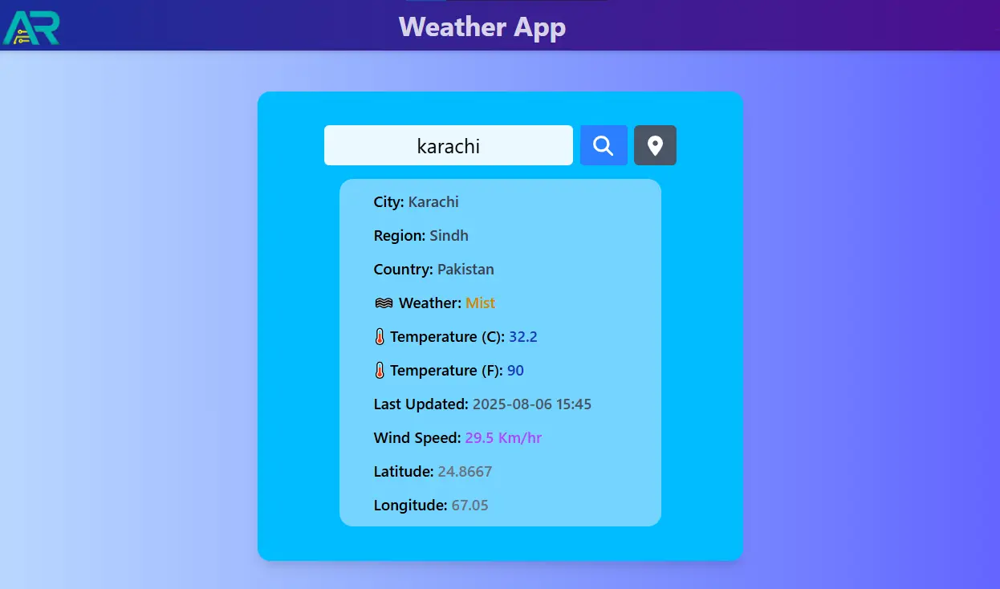

# Weather App


> A blazing fast React application powered by [Vite](https://vitejs.dev/) and modern development practices. Perfect for rapid development, prototyping, and deployment.

---

## 📝 Table of Contents

1. [React Weather App](#ar-QRcodegenerator-react)
2. [Overview](#-overview)
3. [Prerequisites](#-prerequisites)
4. [Installation](#-installation)
5. [Running the Application](#-running-the-application)
6. [Project Structure](#-project-structure)
7. [Available Scripts](#-available-scripts)
8. [Deployment](#-deployment)
9. [Technologies Used](#-technologies-used)
10. [Contributing](#-contributing)
11. [License](#-license)

---

## 📖 Overview

This project is a React + Vite-based web application designed to fetch live weather information using WeatherAPI
It emphasizes performance, fast refresh, minimal configuration, and ease of use.

**Key Features:**
- Lightning-fast development with Vite
- React with hooks and functional components + API integration

---

## ✅ Prerequisites

Ensure you have the following installed:

- [Node.js](https://nodejs.org/) (>= 16.x)
- [npm](https://www.npmjs.com/) or [Yarn](https://yarnpkg.com/)
- Git

Check versions:

```bash
node -v
npm -v
git --version
```

---

## 📦 Installation

Clone the repository and install dependencies:

```bash
git clone https://github.com/Aamir-Rafique/ar-QRcodegenerator-react.git
cd ar-QRcodegenerator-react
npm install 
# or
yarn install

# then
npm i --save @fortawesome/fontawesome-svg-core
npm install --save @fortawesome/free-solid-svg-icons
npm install --save @fortawesome/react-fontawesome
```

---

## 🚀 Running the Application

Start the development server:

```bash
npm run dev
# or
yarn dev
```

Then open [http://localhost:5173](http://localhost:5173) to view it in the browser.

---

## 📁 Project Structure

```
weather-app-react/
├── public/
│   └── images/
├── src/
│   ├── assets/
│   ├── components/
│   │   ├── Navbar.jsx
│   │   ├── Home.jsx
│   │   └── Footer.jsx
│   ├── Services/
│   │   └── api.js
│   ├── App.jsx
│   ├── main.jsx
│   └── index.css
├── .gitignore
├── index.html
├── package-lock.json
├── package.json
├── README.md
├── LICENSE
├── vite.config.js

```

---

## ⚙️ Available Scripts

| Script           | Description                           |
|------------------|---------------------------------------|
| `npm run dev`    | Runs app in development mode          |

---

## 🚢 Deployment

You can deploy this app using:

- **Vercel**
- **Netlify**
- **GitHub Pages**
- Any static host (upload the `dist/` folder after `npm run build`)

**Example (Vercel):**

1. Push your repo to GitHub
2. Link it in your [Vercel dashboard](https://vercel.com/)
3. Set `npm run build` as the build command
4. Set `dist` as the output directory

---

## 🛠 Technologies Used

- [React](https://reactjs.org/)
- [Vite](https://vitejs.dev/)
- [Tailwind CSS](https://tailwindcss.com/) (optional)
- [WeatherAPI](https://www.weatherapi.com/)


---

## 🤝 Contributing

Contributions are welcome! Here's how to get started:

1. Fork the repository
2. Create a new branch (`git checkout -b feature/your-feature`)
3. Make your changes and commit them
4. Push to your fork (`git push origin feature/your-feature`)
5. Open a pull request

Please follow the [Conventional Commits](https://www.conventionalcommits.org/) standard for commits.

---

## 📄 License

This project is licensed under the **MIT License**.  
See the [LICENSE](./LICENSE) file for details.

---

## 📷 Screenshots (Optional)

<p align="center">
  
</p>

---

## 🙋‍♂️ Questions?

If you have any questions or suggestions, feel free to open an issue or reach out on [Gmail](https://mail.google.com/mail/u/0/), [LinkedIn](https://www.linkedin.com/in/aamir-rafique-7a5bb1336/), [GitHub](https://github.com/Aamir-Rafique).

---

> Made with ❤️ by Aamir-Rafique
